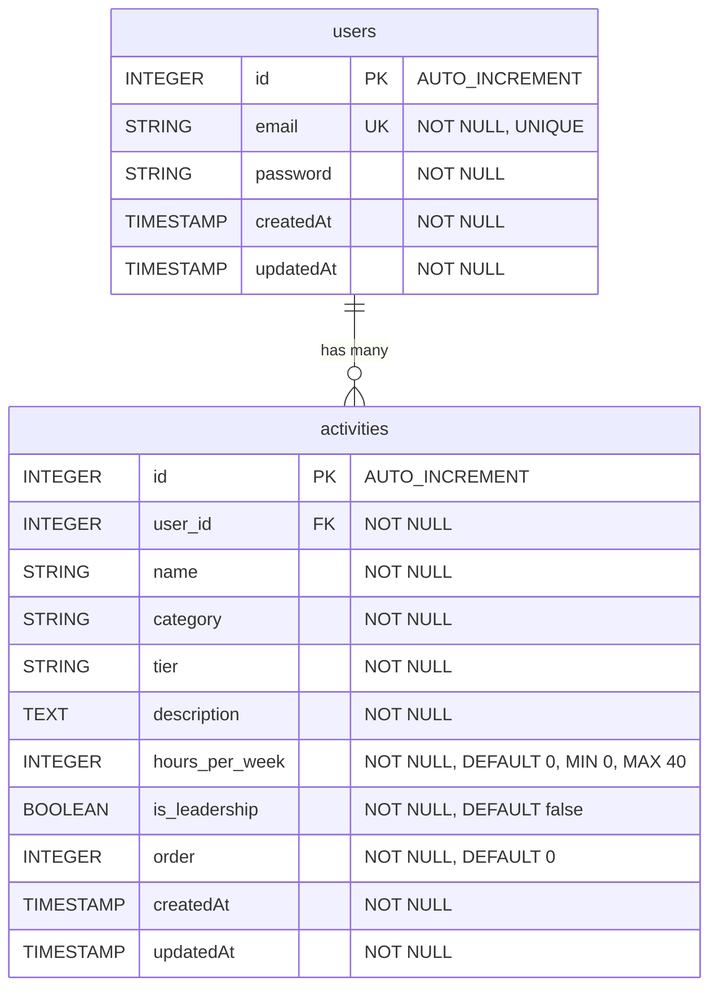

# Entity Relationship Diagram

## DB 스키마

## 각 필드 설명

### users 테이블

| Field     | Type      | Constraints                        | Description                |
| --------- | --------- | ---------------------------------- | -------------------------- |
| id        | INTEGER   | PRIMARY KEY, AUTO_INCREMENT        | 사용자 고유 식별자         |
| email     | STRING    | NOT NULL, UNIQUE, VALIDATE isEmail | 사용자 이메일 (로그인 ID)  |
| password  | STRING    | NOT NULL                           | 암호화된 비밀번호 (bcrypt) |
| createdAt | TIMESTAMP | NOT NULL                           | 레코드 생성 시간           |
| updatedAt | TIMESTAMP | NOT NULL                           | 레코드 수정 시간           |

### activities 테이블

| Field          | Type      | Constraints                        | Description             |
| -------------- | --------- | ---------------------------------- | ----------------------- |
| id             | INTEGER   | PRIMARY KEY, AUTO_INCREMENT        | 활동 고유 식별자        |
| user_id        | INTEGER   | NOT NULL, FOREIGN KEY → users.id   | 활동 소유자 (사용자 ID) |
| name           | STRING    | NOT NULL                           | 활동 이름               |
| category       | STRING    | NOT NULL                           | 활동 카테고리           |
| tier           | STRING    | NOT NULL                           | 활동 등급 (Tier)        |
| description    | TEXT      | NOT NULL                           | 활동 설명 (최대 150자)  |
| hours_per_week | INTEGER   | NOT NULL, DEFAULT 0, MIN 0, MAX 40 | 주당 활동 시간          |
| is_leadership  | BOOLEAN   | NOT NULL, DEFAULT false            | 리더십 역할 여부        |
| order          | INTEGER   | NOT NULL, DEFAULT 0                | 활동 목록 정렬 순서     |
| createdAt      | TIMESTAMP | NOT NULL                           | 레코드 생성 시간        |
| updatedAt      | TIMESTAMP | NOT NULL                           | 레코드 수정 시간        |

## DB 엔진

- DB: SQLite3
- ORM: Sequelize
